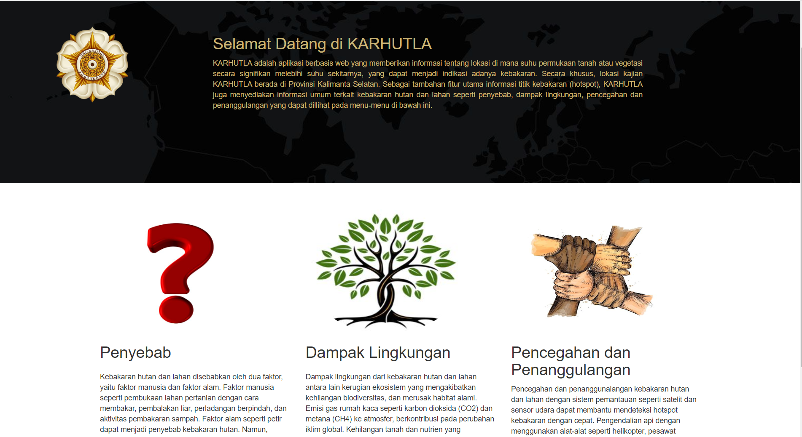
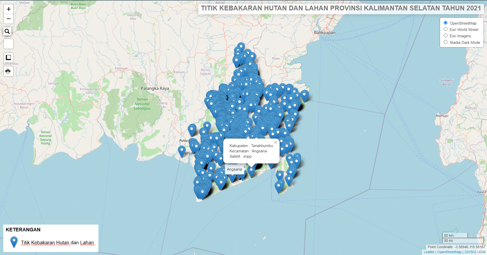
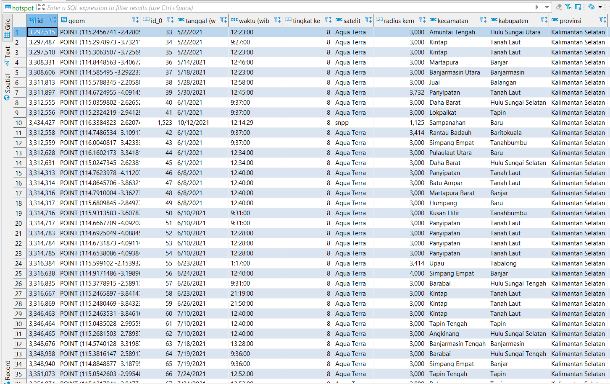

# KARHUTLA
#KARHUTLA

<h2>Nama Produk: KARHUTLA</h2>

<h2>Deskripsi produk:</h2>
KARHUTLA adalah aplikasi berbasis web yang memberikan informasi tentang lokasi di mana suhu permukaan tanah atau vegetasi secara signifikan melebihi suhu sekitarnya, yang dapat menjadi indikasi adanya kebakaran. Secara khusus, lokasi kajian KARHUTLA berada di Provinsi Kalimanta Selatan. Sebagai tambahan fitur utama informasi titik kebakaran (hotspot), KARHUTLA juga menyediakan informasi umum terkait kebakaran hutan dan lahan seperti penyebab, dampak lingkungan, pencegahan dan penanggulangan kebakaran hutan dan lahan. 

<h2>Komponen pembangun produk: </h2>
<ul>
<li>Leaflet JS: sebagai peta berbasis web yang dilengkapi dengan fitur dan plugin</li>
<li>Geoserver: sebagai media penyimpan dan penampil data spasial</li>
<li>bootstrap: sebagai library pelengkap webgis</li>
<li>DBeaver: sebagai sarana pembuatan database KARHUTLA</li>
<li>Xampp: sebagai server lokal untuk menjalankan aplikasi web KARHUTLA</li>
</ul>

<h2>Sumber data:</h2>
<ul>
<li> Data Titik Kebakaran Hutan dan Lahan Tahun 2021 Bersumber dari Badan Penanggulangan Bencana Daerah (BPBD)</li>
<li>Data Batas Administrasi Provinsi Kalimantan Selatan Bersumber Dari Badan Perencanaan Pembangunan Daerah</li>
</ul>

<h2>Tangkapan layar komponen penting produk:</h2>
<ul>
  <li>Landing page</li>  
   <li>Peta persebaran Hotspot Provinsi Kalimantan Selatan</li>  
   <li>Basisdata DBeaver</li>  
  
</ul>